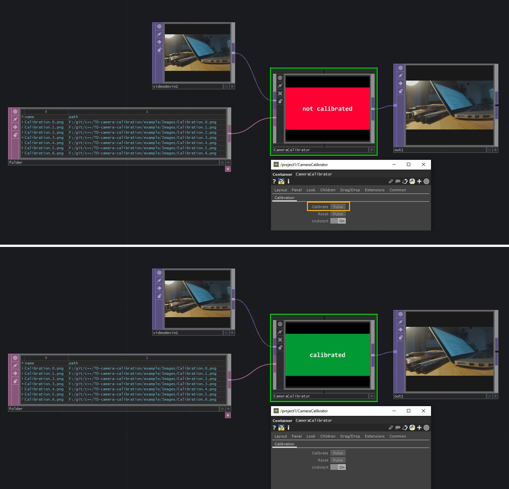

# Touchdesigner Camera Calibration
### Touchdesigner C++ DAT for camera calibration with OpenCV

## Building
- Get [CMake](https://cmake.org/)
- Get [OpenCV](https://opencv.org/), extract it somewhere on your disk
- Create a `build` directory
- Point your CMake source directory to the `src` directory
- In CMake set the `OpenCV_DIR` to `%YOUR_OPENCV_DIR%/opencv/build/x64/vc15/lib`
- **Configure** + **Generate**, Open the solution file in Visual Studio and build
  the `CameraCalibrationDAT.dll`
  
## Why a DAT?
TODO

## TODO
- [ ] Component for capturing images of the calibration pattern
- [ ] Fix asynchronous thread execution
- [ ] Cache calibration parameters
